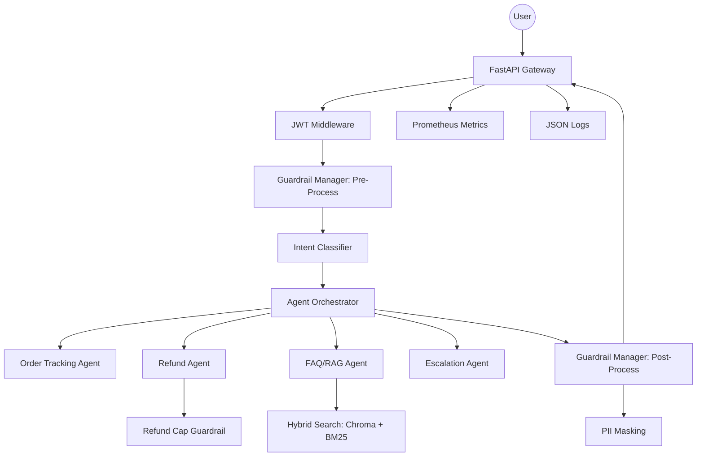

# Novintix: Agentic AI Customer Support System

Novintix is a production-grade, enterprise-ready Agentic AI Customer Support System designed for large e-commerce platforms.

## 🏗️ Architecture Diagram



## ⚙️ Environment Variables

| Variable | Description | Default |
|----------|-------------|---------|
| `JWT_SECRET` | Secret key for JWT signing | `super-secret-key-123` |
| `REDIS_URL` | Connection string for Redis | `redis://localhost:6379/0` |
| `CHROMA_DB_PATH` | Path to persistent ChromaDB | `./data/chroma_db` |

## 📦 Setup & Installation

### Local Development
1. Clone the repository.
2. Install dependencies:
   ```powershell
   pip install -r requirements.txt
   ```
3. Run the development server:
   ```powershell
   python main.py
   ```

### Docker
```powershell
cd infra
docker-compose up --build
```

## 🧪 Testing
Run all tests including advanced guardrails and recovery:
```powershell
python -m pytest tests/
```

## 📈 Evaluation Pipeline
To run the automated evaluation on collected feedback:
```powershell
python feedback/eval_runner.py
```

## 📜 API Documentation
- `POST /token`: Get JWT access token.
- `POST /query`: Process user query (requires JWT).
- `POST /feedback`: Submit user feedback (requires JWT).
- `GET /metrics`: Export Prometheus metrics.
- `GET /health`: System health check.
