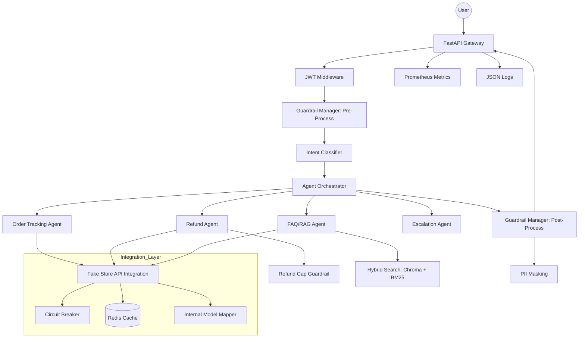

# Novintix: Agentic AI Customer Support System

Novintix is a production-grade, enterprise-ready Agentic AI Customer Support System designed for large e-commerce platforms. It is now integrated with the **Fake Store API** for a realistic, data-driven demo experience.

## 🏗️ Architecture Diagram



## ⚙️ Environment Variables

| Variable | Description | Default |
|----------|-------------|---------|
| `JWT_SECRET` | Secret key for JWT signing | `super-secret-key-123` |
| `REDIS_URL` | Connection string for Redis | `redis://localhost:6379/0` |
| `CHROMA_DB_PATH` | Path to persistent ChromaDB | `./data/chroma_db` |
| `XAI_API_KEY` | API Key for Grok (xAI) | `(Set in .env)` |

## 🚀 Fake Store API Integration
The system now uses `fakestoreapi.com` for its backend:
- **Identity Resolution**: Maps JWT users to FakeStore customer profiles.
- **Order Tracking**: Fetches real carts and converts them to orders with synthetic statuses (Pending, In Transit, etc.).
- **RAG Enrichment**: Automatically ingests FakeStore product catalog into the hybrid search pipeline.
- **Reliability**: Implements a **Circuit Breaker** and **Redis Caching** for all external API calls.

## 📦 Setup & Installation

### Local Development
1. Clone the repository.
2. Install dependencies:
   ```powershell
   pip install -r requirements.txt
   ```
3. Run the development server:
   ```powershell
   python main.py
   ```

### Docker
```powershell
cd infra
docker-compose up --build
```

## 🧪 Demo Flows
See `demo/demo_queries.json` for sample queries covering:
- **Multi-order disambiguation**
- **Shipment delay simulations**
- **Refund guardrail escalations**
- **Product vs. Policy FAQ**

## 📜 API Documentation
- `POST /token`: Get JWT access token.
- `POST /query`: Process user query (requires JWT).
- `POST /feedback`: Submit user feedback (requires JWT).
- `GET /metrics`: Export Prometheus metrics.
- `GET /health`: System health check.
